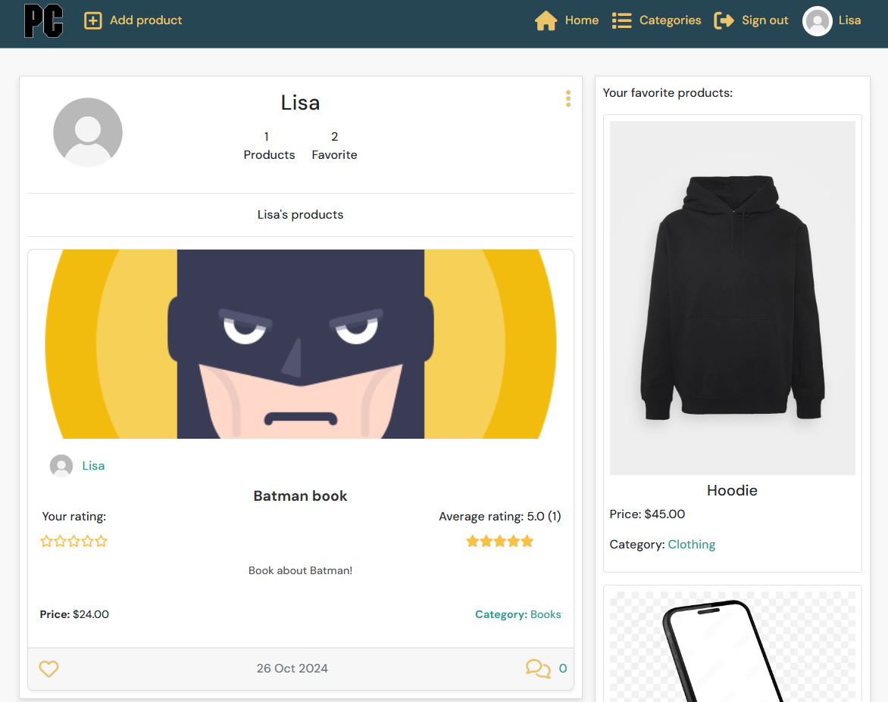
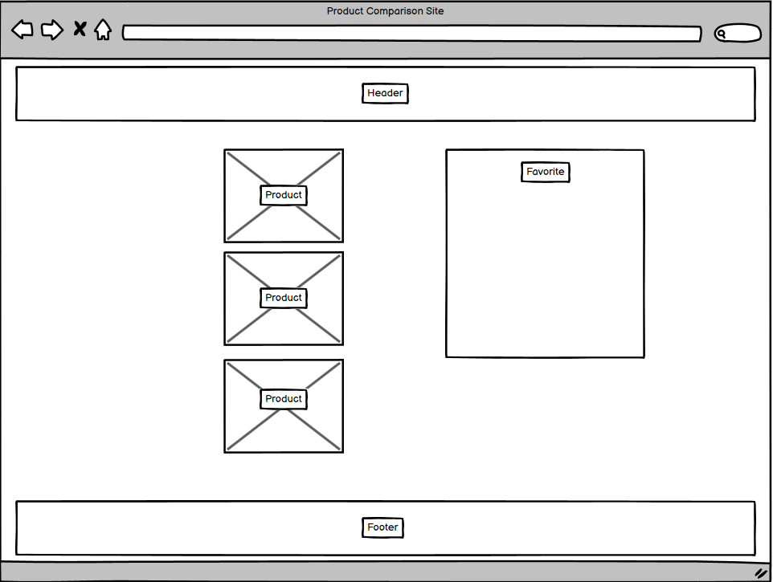
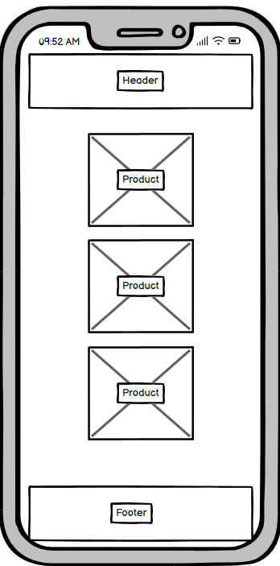

# Product Comparison Site

This site is a **Product Comparison Web Application** that allows users to browse, create, and manage products across various categories. Registered users can log in to compare products by creating products, viewing details, leaving comments, rating and favoriting products they like.

Access the site here <a href="https://product-comparison-site-20f390de390b.herokuapp.com/">Product Comparison Site</a>



## Wireframes

 

## Table of Contents

- [Features](#features)
- [CRUD Functionality](#crud-functionality)
- [Design and Color Scheme](#design-and-color-scheme)
- [Technologies Used](#technologies-used)
- [Testing](#testing)
- [Deployment on Heroku](#deployment-on-heroku)
- [Local Deployment](#local-deployment)
- [Known Issues and Future Improvements](#known-issues-and-future-improvements)
- [Credits](#credits)
- [License](#license)

---

## Features

1. **User Authentication**
   - Secure signup, login, and logout functionality.
   - Profile page with editable personal information.

2. **Product Management**
   - Users can create new products, including details such as name, description, price, and category.
   - Each product has a detail view with features for rating, favoriting, and commenting.

3. **Interactive Product Comparison**
   - Users can rate products from 1 to 5 stars and see an average rating based on all ratings.
   - Users can add products to a "favorites" list for easy comparison.

4. **Category and Search Options**
   - Products are categorized (e.g., electronics, clothing, books, shoes) for easier browsing.
   - Search functionality to filter products by keywords and categories.

5. **Commenting System**
   - Users can leave comments on products and view other users' comments for discussion and feedback.

6. **Responsive Design**
   - Mobile-friendly layout that adjusts based on screen size for seamless use on all devices.

---

## CRUD Functionality

The site provides **full CRUD functionality** for products and comments:

1. **Create**
   - Users can create new product entries, including uploading images, setting a price, and selecting a category.
   - Users can add comments on products and rate them.

2. **Read**
   - Users can browse all products or filter by category.
   - Individual product detail pages show complete information, ratings, comments, and related actions.

3. **Update**
   - Users can edit products they've created, adjusting details like name, description, and price.
   - Profile information can be updated directly on the profile page.

4. **Delete**
   - Users can delete products and comments they have created.

---

## Design and Color Scheme

#### Color Scheme: Cool and Calming Palette
The design uses a color palette with a calm, professional aesthetic:
   - **Deep Blue (#264653)**: Primary background color, used for the navbar and footer.
   - **Golden Yellow (#E9C46A)**: Accents for buttons, highlights, and icons.
   - **Teal (#2A9D8F)**: Used in active elements, such as hovering over icons or navigation links.
   - **Muted Orange (#F4A261)**: Accent color for alerts, buttons, and notifications.
   - **Light Background (#f8f8f8)**: Main background for content, creating a clean and modern look.

#### Layout and Typography
   - **Font**: The primary font is *DM Sans*, chosen for its readability and modern appearance.
   - **Grid System**: The app uses Bootstrap's grid system for a responsive layout that scales well across devices.
   - **Images**: High-quality product images are used for each product entry, with placeholders for products without images.

---

### Technologies Used

The following technologies are used to build and deploy the project:

#### Frontend
   - **React**: Frontend framework for a modular, interactive UI.
   - **React Bootstrap**: Used for responsive layout and pre-styled components.
   - **Axios**: For handling API requests between the frontend and backend.
   - **FontAwesome**: Provides icons for actions like editing, deleting, and navigating.

#### Backend
   - **Django & Django REST Framework**: RESTful backend, providing secure and structured data handling.
   - **Django CORS Headers**: Manages Cross-Origin Resource Sharing (CORS) for secure requests between the frontend and backend.
   - **dj-rest-auth**: Simplifies authentication processes, including login, registration, and token management.
   - **django-allauth**: Provides robust authentication solutions, supporting features like social login.
   - **django-filter**: Simplifies filtering functionality in Django REST Framework views, making it easier to search and filter data.
   - **djangorestframework-simplejwt**: JWT-based authentication system used for secure, stateless authentication between the client and server.
   - **dj-database-url**: Simplifies database configuration, particularly useful for managing environment-specific databases (like Heroku’s Postgres).
   - **PostgreSQL**: Database for storing product, user, and comment data.
   - **Cloudinary**: Cloud storage service used to store and retrieve media files like product images.

#### Deployment
   - **Heroku**: Used for deploying both the Django backend and React frontend.
   - **Gunicorn**: WSGI HTTP Server for running the Django application in production, providing high performance for handling requests.
   - **GitHub**: Version control and project management.

#### Additional Libraries (General Support)
   - **Whitenoise**: Serves static files efficiently in production without relying on an external file server.
   - **cloudinary**: Integrates with Django to manage media files, providing cloud storage and retrieval.
   - **requests and requests-oauthlib**: Used to handle external HTTP requests and OAuth flows, facilitating secure API integrations.
   - **psycopg2-binary**: PostgreSQL adapter for Python, essential for connecting Django to the Postgres database.

---

## Testing

Testing for the application includes **manual testing** and **automated tests** for the backend.

1. **Manual Testing**
   - Each feature, including creating, editing, and deleting products, comments, and profiles, has been tested on multiple browsers and devices to ensure compatibility and responsiveness.
   - Manual tests for form validation, login authentication, and API request handling.
   - Test the rating, favoriting, and commenting systems to ensure correct updates to the UI and database.

2. **Automated Testing**
   - Basic unit tests for backend views and serializers in Django.
   - Tests cover product creation, editing, and permission handling to verify secure and correct behavior.
   - Continuous integration with GitHub Actions ensures that tests run automatically for each commit.

3. **User Testing**
   - Feedback has been gathered from users to identify any usability issues, which have been resolved to enhance the user experience.
  
4. **Error Pages**
   - Navigated to a non-existent URL.
   - Induced a server error to test the 404 error page.

5. **Browser Testing**
   - Viewed the website in different browsers.
      - Google Chrome
      - Mozilla Firefox
      - Microsoft Edge

6. **Responsive Design Testing**
   - Viewed the website on different devices (desktop, tablet, mobile).

7. **Accessibility Testing**
   - Used tools like Lighthouse and WAVE to test accessibility.


8. **Performance Testing**
   - Used tools like Google PageSpeed Insights to test page load times and performance.

9. **Deployment Testing**
   - Deployed the application to Heroku and tested all functionalities.

---

## Getting Started with Create React App

This project was bootstrapped with [Create React App](https://github.com/facebook/create-react-app).

## Available Scripts

In the project directory, you can run:

### `npm start`

Runs the app in the development mode.\
Open [http://localhost:3000](http://localhost:3000) to view it in your browser.

The page will reload when you make changes.\
You may also see any lint errors in the console.

### `npm test`

Launches the test runner in the interactive watch mode.\
See the section about [running tests](https://facebook.github.io/create-react-app/docs/running-tests) for more information.

### `npm run build`

Builds the app for production to the `build` folder.\
It correctly bundles React in production mode and optimizes the build for the best performance.

The build is minified and the filenames include the hashes.\
Your app is ready to be deployed!

See the section about [deployment](https://facebook.github.io/create-react-app/docs/deployment) for more information.

### `npm run eject`

**Note: this is a one-way operation. Once you `eject`, you can't go back!**

If you aren't satisfied with the build tool and configuration choices, you can `eject` at any time. This command will remove the single build dependency from your project.

Instead, it will copy all the configuration files and the transitive dependencies (webpack, Babel, ESLint, etc) right into your project so you have full control over them. All of the commands except `eject` will still work, but they will point to the copied scripts so you can tweak them. At this point you're on your own.

You don't have to ever use `eject`. The curated feature set is suitable for small and middle deployments, and you shouldn't feel obligated to use this feature. However we understand that this tool wouldn't be useful if you couldn't customize it when you are ready for it.

## Learn More

You can learn more in the [Create React App documentation](https://facebook.github.io/create-react-app/docs/getting-started).

To learn React, check out the [React documentation](https://reactjs.org/).

### Code Splitting

This section has moved here: [https://facebook.github.io/create-react-app/docs/code-splitting](https://facebook.github.io/create-react-app/docs/code-splitting)

### Analyzing the Bundle Size

This section has moved here: [https://facebook.github.io/create-react-app/docs/analyzing-the-bundle-size](https://facebook.github.io/create-react-app/docs/analyzing-the-bundle-size)

### Making a Progressive Web App

This section has moved here: [https://facebook.github.io/create-react-app/docs/making-a-progressive-web-app](https://facebook.github.io/create-react-app/docs/making-a-progressive-web-app)

### Advanced Configuration

This section has moved here: [https://facebook.github.io/create-react-app/docs/advanced-configuration](https://facebook.github.io/create-react-app/docs/advanced-configuration)

### Deployment

This section has moved here: [https://facebook.github.io/create-react-app/docs/deployment](https://facebook.github.io/create-react-app/docs/deployment)

### `npm run build` fails to minify

This section has moved here: [https://facebook.github.io/create-react-app/docs/troubleshooting#npm-run-build-fails-to-minify](https://facebook.github.io/create-react-app/docs/troubleshooting#npm-run-build-fails-to-minify)

---

## Deployment on Heroku
To deploy the Product Comparison Site on Heroku, follow these steps:

### Prerequisites
- Ensure you have a Heroku account. Sign up at Heroku if you don't have one.
- Prerequisites
- Python 3.x
- Django
- Cloudinary account (for image storage)

**Steps to Deploy**
- Login to Heroku:
- Create a new Heroku app:
- Add a PostgreSQL database to your app:

1. **Set up environment variables:**
- In your local project directory, create a .env file and add your environment variables (e.g., Database URL, Django secret key, Cloudinary URL). You also need to set them directly in Heroku when deploying.

```console
os.environ.setdefault("DATABASE_URL", "your-database-url")

os.environ.setdefault("DJANGO_SECRET_KEY", "your-secret-key")

os.environ.setdefault("CLOUDINARY_URL", "your-cloudinary-url")
```

2. **Prepare your project for Heroku deployment:**
- Create a Procfile in the root of your project:
- Create runtime.txt in the root of your project:

```console
web: gunicorn your_project_name.wsgi:application

python-you're.version
```

- Install all dependencies from requirements text

```console
pip install -r requirements.txt
```

- Update config vars in Heroku dashboard under settings in your Heroku app to use the environment variables of your project (e.g., Database URL, Django secret key, Cloudinary URL), excatly to match.
- The config vars to update in Heroku dashboard settings is DATABASE_URL, ALLOWED_HOSTS, CLIENT_ORIGIN, CSRF_TRUSTED_ORIGINS, DEBUG, DEV and SECRET_KEY. All of these are pointed correctly in the settings.py Django app so no changes needed there.

- Run npm run build in the frontend folder to remove existing static folder and move over new static folder everytime changes are made to the frontend
- Run collectstatic to ensure all static files, including those from your Django app and any third-party apps, are gathered correctly in the staticfiles directory

```console
cd frontend
npm run build; Remove-Item -Recurse -Force ../staticfiles/build; Move-Item -Path build -Destination ../staticfiles/

python manage.py collectstatic --noinput
```

3. **Initialize a Git repository if you haven't already:**

```console
git init
```

- Commit your changes:

```console
git add .
git commit -m "Prepare for Heroku deployment"
```

- In Heroku dashboard where you created your new app in the deploy tab conntect your github and then deploy your branch.
- Open your deployed app in the browser:

---

## Local Deployment

1. **Clone the repository:**

```console
git clone https://github.com/yourusername/product-comparison-site.git
cd product-comparison-site
```

2. **Install the Required Dependencies**

```console
pip install -r requirements.txt
```

3. **Set up enviorment variables**
- Create env.py file in the root of your project directory and update your enviorment variables (e.g., Database URL, Django secret key, Cloudinary URL)
- The enviorment variables to update in env.py file is DATABASE_URL, ALLOWED_HOSTS, CLIENT_ORIGIN, CSRF_TRUSTED_ORIGINS, DEBUG, DEV and SECRET_KEY. All of these are pointed correctly in the settings.py Django app so no changes needed there.

4. **Set up the database:**

```console
python manage.py makemigrations
python manage.py migrate
```

5. **Create a superuser:**

```console
python manage.py createsuperuser
```

6. **Run the development server:**
- Open up / split two terminals, one for Django and one for React

```console
python manage.py runserver

cd frontend
npm start
```

7. **Navigate to the project in your browser:**
- http://127.0.0.1:8000/ - Django app
- http://127.0.0.1:3000/ - React app

---

## Known Issues and Future Improvements

**Known Issues:**
- Describe any known issues here.

**Future Improvements:**
- Testing application with Django testing
- Improving code functionality in different areas
- Improving categories section with new exciting categories
- Implement site to compare on other products on other sites

---

## Credits

**Content**
  - Some of the text for the README.md file were taken from <a href="https://chat.openai.com/">ChatGPT</a>
  - Much of the backend taken from <a href="https://github.com/Code-Institute-Solutions/drf-api">Django drf-api</a>
  - Much of the frontend taken from <a href="https://github.com/mr-fibonacci/moments">React moments</a>
  - Styling taken from <a href="https://github.com/mr-fibonacci/moments">React moments</a>

## License
- This project is licensed under the MIT License - see the LICENSE file for details.

---

This README provides an overview of the application, its core functionality, design details, technologies, and testing methodologies. Please adjust any specific project information and feature descriptions based on the actual implementation.
